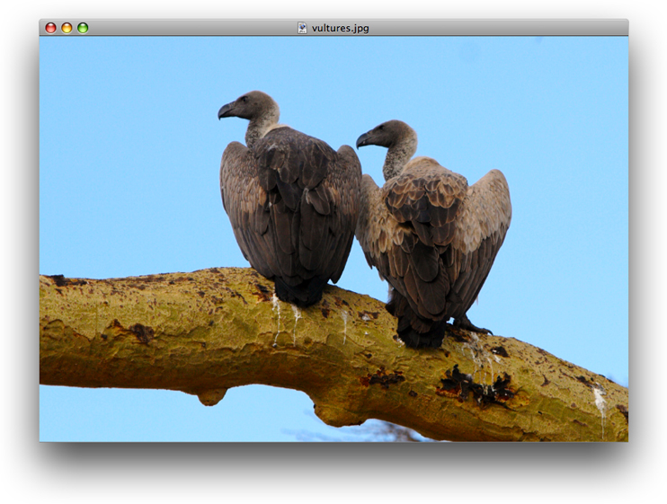
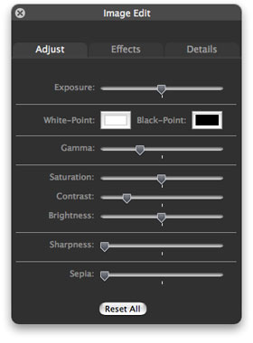
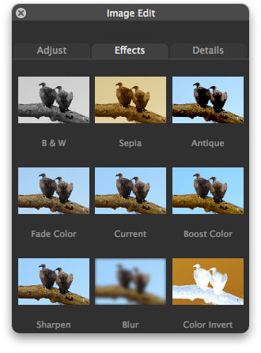
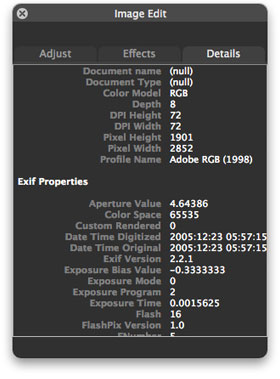

!SLIDE 
# IKImageView #

!SLIDE bullets incremental smbullets pretty-uls
## IKImageView ##

- Similar to any view that contains an image (**NSView**, **NSImage**)
- Double-clicks an image brings an **Image Edit Panel**
- Set the appropriate **image view state**
- Set up a **shared instance** of the Image Edit panel (**IKImageEditPanel**)
- Set the **data source**
- **Image Kit framework** takes care of the rest

!SLIDE images
## IKImageView ##

