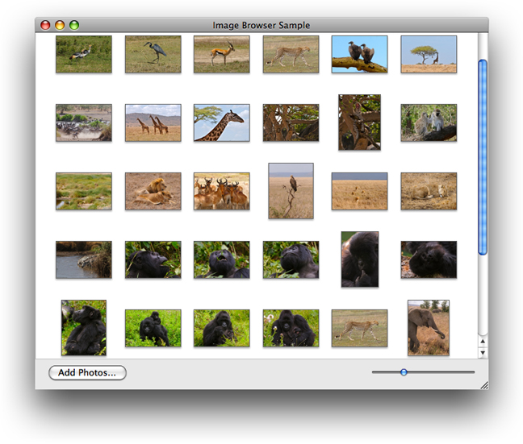

!SLIDE 
# IKImageBrowserView #

!SLIDE bullets smbullets pretty-uls mini-browser-1
## IKImageBrowserView ##

- Display a **collection of images**
- Item size depends on **zoom** value
- Support for **drag and drop**
- Set **IKImageBrowserDataSource**
- Set **IKImageBrowserDelegate**
- Create **IKImageBrowserItem** objects
